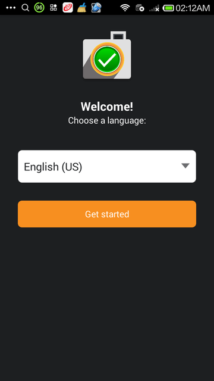
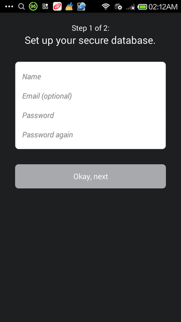
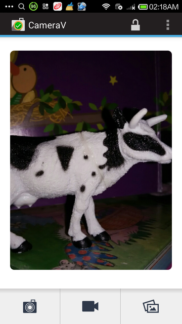
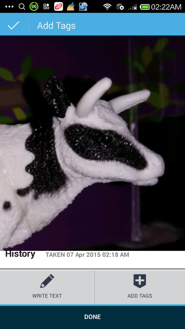
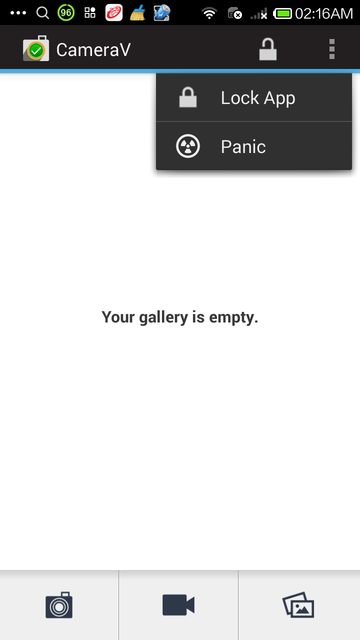

### Brukerveiledning for InformaCam systemet og CameraV

## STOL PÅ (MEN BEKREFT!) DET ØYNENE DINE SER

InformaCam er et system som bruker innebygde sensorer i moderne mobiltelefoner for å spore bevegelse, lys sågar som Wi-Fi, Blåtann, og radiomast-informasjon til å lage en digital avbildning av miljøet rundet deg, mens du tar et bilde eller en video. Denne ekstra metadataen (dataen om dataen!) hjelper deg med å bekrefte å betro datoen, tiden og stedet bildet ble tatt. Det muliggjør et nytt lag med bindeleddsinformasjon fra "usynlig" energi til bruk hvordan det nå måtte passe deg. I siste instans er digitale signaturer og kryptering noe som forsikrer deg om at mediafilene ikke har blitt tuklet med siden de ble laget, og at de bare ses av dem du ønsker.

Foreløpig kan du bare bruke InformaCam ved å installere CameraV-programmet for Androidtelefoner. CameraV bruker V for verifisering, Veritias (Sannhet!) og Velv (sikret!). Det hentyder også V-tegnet for seier og fred. 

## Enkelt å bruke

CameraV er den enkleste måten å ta og dele sikrede bilder og videoer på en smart-telefon eller nettbrett.

## Sensor Smart

CameraV gjør sensorinformasjon som kompasskurs, lys, temperatur, plassering med mer til "metadata i det godes ærende".

## Del mediafiler og metadata

Last opp og del media delt fra CameraV nårhen du ønsker, og folk kan stole på det øynene deres ser.

## Krypterings-kraft

CameraV har sterk kryptering og nettverkssikkerhet ved bruk av innebygd OpenPGP, IOCipher og Tor.

## Åpent og fritt

CameraV, og InformaCam-systemet, er åpen kildekode, fritt lisensiert til bruk for enhver privatperson eller organisasjon.# Kapittel 1: Hurtigveiledning

## Kom igang med sikret og verifisert mobil-media

Dette dokumentet vil gå i detalj om hele KameraHull-konseptet ved en senere anledning, men nå ønsker vi å starte med noen enkle funksjoner. Bruk Google Play eller FDroid.org, du trenger å installere CameraV-programmet på din Android-telefon. Påkrevd versjon 4.0 eller høyere.

## 3 ting du kan gjøre raskt med CameraV

1) Ta bilder eller video med synkronisert metadata fra sensorer for senere bruk i verifisering, analyse, som bevisførsel, eller andre angrepsvektorer.

2) Attester bilder og video ved deling av unik ID og sensor-metadata gjennom e-post, SMS eller sosiale media.

3) Del bilder og videoer privat eller offentlig med sensor-metadata innebygd i media-filene, for senere verifisering og bruk.

##  Ta bilder eller video med sensor-metadata

Sensorer tilknyttet CameraV skrur seg på automatisk når du tar opp noe. Du kan ved eget valg skru på plassering, Blåtann og Wi-Fi -tjenester i dine Android-innstillinger for å la programmet bruke også de sensorene.

### Skru på sensorer

- Du bestemmer om Wi-Fi, Blåtann og GPS skal brukes
- Med hensyn til plasseringsdata kan du selv velge tjenesten som skal brukes
- For å skru av mobiltelefoni-sensorer, sett telefonen i "fly-modus"

### Visning av bilder og video i galleriet

Galleri-knappen åpner flerfoldig miniatyrvisning. Trykk et miniatyrbilde for å åpne detaljert visning.

Avkryssningssboks for flerfoldig valg og sletting.

## Attestering av bilder og video

Du kan generere en unik visuell fingeravtrykksidentifikator, egentlig en unik kode, for hver enkelt media-fil du har laget. Du kan så dele denne korte koden gjennom SMS, e-post eller mer offentlig gjennom sosiale media.

## Deling av bilder, videoer og sensor-metadata 

## Delingsvalg

Valg for delingsområde:
Del media
Del metadata
Attester

Del metadata bare som JSON-klartekst
Attester: unik ID for media og lenke til mediasiden på sikret testplattform
# Kapittel 2: Kan dette stemme?

## Kan dette stemme? Hvordan InformaCam forbedrer verifisering av mobil-mediafiler

Det hagler med media fra verdens mobile enheter for bruk som bevismateriale fra betrodde kilder for journalister. WITNESS og Guardian-prosjektet jobber med å utarbeide en mekanisme, InformaCam, for å verifisere og sjekke gyldigheten til dette kildematerialet.

Sent i fjor ble antivirus-pioneeren John McAfee arrestert i Guatemale etter å ha rømt fra sitt hjem i Belize der han var ettersøkt for å svare på spørsmål knyttet til mordet på sin nabo. McAfee's posisjon ble ved en feiltagelse utgitt gjennom innebygget metadata i iPhone-bildet publisert av journalistene som intervjuet han.

Bilder tatt med mobiltelefoner inneholder ofte innebygget informasjon, kjent som metadata, som kan ta opp informasjon inkludert: kameratypen som tok bildet, dato og tidspunkt. De kan også inneholde informasjon som GPS-koordinater, hvilket kan brukes til å fastslå hvor et bilde eller video ble tatt. Noen ganger kan metadata oppgi informasjon som brukeren ikke ønsker å dele.

Vi har trent menneskerettsaktivister om sikkerhetsrisikoene knyttet til metadata i digitale filer en stund nå. Å ta opp video med sensitiv informasjon kan skade dem det gjelder. Som motsvar har vi og våre partnere i Guardian-prosjektet laget KameraHullet, et program for mobiltelefoner som i tillegg til å fjerne metadata, også automatisk fanger opp og visker ut ansikter i videoer og bilder. For omtrent seks måneder siden introduserte YouTube lignende funksjonalitet.

Facebook-bruker Gregory Michael delte dette falske bildet som viser en hai i kjølvannet av superstormen Sandy i New Jersey, USA
Dog er det mange ganger da journalister og menneskerettighetsbeskyttere trenger å bevare mer informasjon istedenfor mindre, i den hensikt å forsikre at deres digitale filer holder mål senere som bevismateriale eller for arkivformål. Eller det kan hende de vil ha plasseringsdata, tilleggsinformasjon om hva de dekker, og muligheten til å kryptere det hele, i et tiltak for å hjelpe mediapublikasjoner med å tiltro og bekrefte innholdet. I en alder der digital billedmanipulasjon er allemannseie, har nyhetsbyråer bevisførselen på sin side når det gjelder å fastslå om media har blitt tuklet med eller ei.

Syria er et slikt eksempel, der mobiltelefonvideo har blitt brukt i utstrakt grad for å dukumentere potensielle krigsforbrytelser sågar som å tjene som potensiell propaganda. Mer dagligdags scenarioer finnes i de fleste situasjoner, som det ufattelige bildet av  tornadoen i Alabama.

For å imøtekomme de behovene har vi jobbet med KameraHullet, et mobilprogram som gir Android-enheter muligheten til å ta opp bilde og videoer, bygge inn geotemporær og annen metadata, signere digitalt med fingeravtrykk unikt for kameraets sensor, kryptere og sende de filene til noen de stoler på som har en sikker data-tjener. I tillegg til andre ting, bevares overrekkelseskjeden til mediafilene, noe som gjør det mer gangbart i rettssammenheng.

Siden vi annonserte prosjektet, har vi jobbet med å forbedre funksjonaliteten på programmet og å bygge en sikker tjenerprototyp som lagrer og bekrefter overrekkelseskjeden til media-filene. Sammen med WITNESS, Guardian-prosjektet og våre partnere i International Bar Association, håper vi å ha et pilotprosjekt klart for testing i løpet av de neste månedene. Deretter er planen å lage en installasjonskandidat som lar hvem som helst enkelt sette opp sine egne pakkebrønner.

Når en bruker kjører KameraHullet for første gang, går en veileder gjennom stegene for å lage et passord for programmet og hvordan man genererer en krypteringnøkkel basert på den unikt spesifikke informasjonen fra kamerasensoren. Siden hvert kamera har et unikt mønster med kamerastøy, er det mulig å lage et "fingeravtrykk" av dette. Denne nøkkelen brukes til å bekrefte at all media tatt opp med programmet som har blitt lastet opp til den sikre tjeneren, faktisk kommer fra dette kameraet.

Når oppsettet er fullført, har brukeren valget om å ta et bilde eller skyte video. Under opptaksprosessen har KameraHullet kontinuerlig tilgang til de forskjellige sensorene på den mobile enheten. Inklusive:

* Bevegelse, som aksellerometere som tar opp all kamerabevegelse under opptaksprosessen - dette fungerer for eksempel som hjelp til å fastslå om en person var i et kjøretøy mens opptaket skjedde.
* Posisjon, Som GPS-data, kan fastslå ganske eksakt hvor bildet eller videoen ble tatt - denne dataen kan senere plottes i et kart
* Omgivelse, som termometer, kan senere sjekkes mot klimatisk og temperaturdata fra området

Denne sensordataen lager et digitalt fingeravtrykk av omgivelsene mediafilen ble tatt i, og tillater senere analyse for å bekrefte at ikke bare var mediafilene tatt opp av en gitt enhet på en spesifikk dato, tid og sted, men også sjekk av denne dataen opp mot værforhold i tidsrommet. Den fanger også opp hvilke Wi-Fi-nettverk og Blåtann-enheter som var i nærheten sånn at disse kan brukes for å støtte opp om, og (i fall det er mobiltelefoner) hvile mobiltårn enheten kommuniserte med.

Denne forbedrede metadataen pakkes sammen med mediafilen og begge deler blir kryptert og sjekksummert, en liten tekst som tjener som "digital signatur". Siden denne digitale signaturen er så kort, kan den raskt sendes via e-post eller som SMS til en sikker tjener eller til tredjepart som igjen kan bekrefte at hverken mediafilen eller metadataen på noe vis er tuklet med siden den ble tatt opp. Dette kan være veldig nyttig i fall der brukeren har begrenset tilgang til høyhastighetsforbindelse for data.

For eksempel, hvis en bruker tar opp materiale fra et grisgrendt område i Kenya med begrenset GSM-dekning, men ingen data-tjeneste, kan KameraHullet sende sjekksummen til mediafilen via SMS til en sikker data-tjener. En uke senere, når brukeren kommer tilbake til kontoret der en høyhastighetstilknytning er tilgjengelig, vil KameraHullet fullføre opplastingsprosessen og de nyankomne mediafilene kan sjekkes mot sjekksummen fra felten.

Fremtiden for mobil media som bevisførsel

Vi blir ofte spurt hva det beste kamera for menneskerettsvideo-formål er, og som fotografer vet, er det beste kameraet det du har med deg når du trenger å ta et bilde. Om det er et bilde av et bilkrasj du skal sende til forsikringsselskapet eller krigsforbrytelser i Syria, kommer vanlige bilder i de fleste fall fra vanlige folk som har gjort bruk av mobiltelefoner.

Muligheten til å automatisk verifisere disse videoer og bildene er viktig for menneskerettighetsbeskyttere, journalister, eller vanlige folk. Disse telefonene har som oftest tilleggsinformasjon som kan brukes til å fastslå personen som har tatt bildet eller videoen, men denne samme dataen kan også brukes som viktig bevismateriale for å bekrefte at noe har hendt på angitt tidspunkt og sted. KameraHullet bruker innebygde funksjoner fra mobiltelefoner for å innhente denne dataen, beskytte den, og å tilkjennegi en mekanisme som kan brukes til bruk for verifisering av hvorvidt data har blitt tuklet med. Dette beskytter gangen i overrekkelseskjeden, noe som bidrar til bevisets stilling.

Vårt håp er at KameraHullet såvel som dets funksjoner, som J3M, tas i bruk av vanlige folk og utviklere. Vi ønsker kommersielle tilbydere å bygge inn disse bevisførsels-funksjonene i deres egne produkter og plattformer - som et "vitne"-modus i ditt kamera eller som et tilvalg når når du laster opp eller deler en video på YouTube, Twitter eller Facebook. I fremtiden ønsker vi muligheten til å være et publikumsvitne for alle rundt i verden som befinner seg i tilknytning til noe nyhetsverdig, det være seg en nyhetshendelse eller et menneskerettighetsbrudd.
# Kapittel 3: Om sensorer og metadata

Dette innebefatter sensorer som KameraHullet gjør bruk av på telefonen og J3M-formatet (JSON Mobile Media Metadata) vi bruker for å lagre dataen.

## J3M-eksempelfil

Nedenfor finner du en markert versjon av JSON-dataen som er å finne i en typisk J3M-forpakning.

The "asset_path" represents where the file was original stored on the InformaCam app's encrypted internal storage. This will be rarely used, but could be helpful in extreme situations where inspection of the capture device is necessary:
> {"asset_path": "submissions/45454ac1ade36ebec3749e8dc2aedc4b", 

"Genealogy" (arverekkefølge)-merkelappen inneholder data om medie-filas opphav i all enkelhet. "hashes" er en MD5-sjekksum av alle pikselverdiene til bildet eller video-forløpet. "createdOnDevice" er offentlig OpenPGP nøkkelfingeravtrykk for brukeren/programmet. "dateCreated" er en lagret tidspunktsverdi som skriver seg til når media-opptaket fant sted.

>"genealogy": {"localMediaPath": "/e61756a62a37535b77b0183318c79d26a2e0bdf0", "hashes": ["9230de4b067b2f14afcaa41d23b30a09"], "j3m_version": "J3M version 1.0", "createdOnDevice": >"694db2c3ecc07ac07f63e323f7b9a0cefada94cf", "dateCreated": 1386690725995}, 

file_name er navnet på den lagrede J3M-fila på telefonens internminne
>"file_name": "kxerFDrNCHiNOxawWUgYEbknbC.j3m", 

"public_hash" er en kryptografisk SHA-1 -sjekksum som kombinerer brukerens nøkkelfingeravtrykk og MD5 media-sjekksummen nevnt ovenfor. Dette brukes som søkbar offentlig symbol-identifikator for media-fila.
>"public_hash": "b840cbfd806865fff8cc34078540224cfe804ae5",

Dataen bak "Intent" representerer hvem som gjorde opptaket, deres PGP-nøkkelfingeravtrykk, og hvem medie-fila var ment for, sammen med hvis noen, overleveringsinformasjon. Informasjonen "intendedDestination" kommer fra "trusted destination" eller ICTD-konfigurasjonsfiler, som er lagret i programmet.
> "intent": {"alias": "ai whiteness", "ownershipType": 400, "pgpKeyFingerprint": "694db2c3ecc07ac07f63e323f7b9a0cefada94cf", "intendedDestination": "InformaCam Testbed"},
> "date_admitted": 1386726920279.5662, "_id": "86ae352e68328c06de7840f4cb6be809",

The "data" section is where the sensor metadata logs are stored. It is an array of timestamped sensorCapture items
> "data": {
>"sensorCapture": [

Dette er en orienterings-hendelse, inneholdende azimuth, slingring og giring, både i rå-format og "corrected" (korrigert) basert på brukerens orientering når de holder telefonen.
>{"timestamp": 1386690720753, "captureType": 271, "sensorPlayback": {"azimuthCorrected": -1.84727144241333, "pitchCorrected": 0.017154498025774956, "azimuth": 43.07861328125, "pitch": >-18.8385009765625, "roll": -132.7789306640625, "rollCorrected": -0.12050031125545502}}, 

Dette er en lysmålingsverdi
>{"timestamp": 1386690734267, "captureType": 271, "sensorPlayback": {"lightMeterValue": 13}}, 

Dette er en kombinert hendelse med lysmetering og trykkdata, både i rå og justert form, basert på telefonens indikerte lokale hevning.
>{"timestamp": 1386690729261, "captureType": 271, "sensorPlayback": {"pressureHPAOrMBAR": 1007.3463134765625, "lightMeterValue": 10, "pressureAltitude": 49.26783752441406}},

"visibleWifiNetworks" innhenter nettverksnavn, frekvens, styrke og MAC-adresse for Wi-Fi nettverk innen rekkevidde.
>{"timestamp": 1386690729939, "captureType": 271, "sensorPlayback": {"visibleWifiNetworks": [{"bssid": "28:c6:8e:ba:ea:dc", "wifiFreq": 5220, "wifiLevel": -93, "bt_hash": >"afbf1e7ffc07f6b4471e34f8470f5fde947a8f2b", "ssid": "cloudcity5ghz"}, {"bssid": "1c:af:f7:d8:db:61", "wifiFreq": 2462, "wifiLevel": -88, "bt_hash": >"9c1cb7186bea393589ac3a591052f91da423205e", "ssid": "Cloud10"}, {"bssid": "28:c6:8e:ba:ea:da", "wifiFreq": 2437, "wifiLevel": -61, "bt_hash": "7b3b34fe541048f0e0800f1b788dc44cfdf6a59d", >"ssid": "cloudcity"},... 

Dette er GPS-posisjonsdata, visning av høyde og breddegrad, gjeldende slingringsmonn på sensoren, avhengig om den baserer seg på satelitt, Wi-Fi, mobilmaster osv.
> {"timestamp": 1386690719706, "captureType": 271, "sensorPlayback": {"gps_coords": [-71.1253508, 42.3286856], "gps_accuracy": "32.119"}}, 

Aksellerometer som viser bevegelse i X, Y og Z-aksen.
>{"timestamp": 1386690721758, "captureType": 271, "sensorPlayback": {"acc_z": 9.188077926635742, "acc_y": 2.7202823162078857, "acc_x": -1.9511220455169678}},

This is a telephony event, showing both any bluetooth devices noticed in the area, and information about the cellular network tower the smartphone is currently registered with. If the device is a wifi only device, or is not using a SIM card, this data will simply be omitted. The bluetooth device address does NOT display the name of the actual device MAC address, but instead shows a one-way hash value. This was an attempt to preserve some privacy for individuals who might be in the area.
>{"timestamp": 1386690719714, "captureType": 271, "sensorPlayback": {"bluetoothDeviceAddress": "5d9d203488950ff20c07b6dbfe9a8b8ddabafc6c", "LAC": "36493", "MCC": "310260", >"bluetoothDeviceName": "Nexus 4", "cellTowerId": "79211356"}}, 

Etter sensordata, viser J3M vanlig "EXIF" lignende informasjon fra opptaksenheten:
> "exif": {"orientation": 0, "focalLength": -1, "timestamp": "2013:12:10 10:51:48", "make": "LGE", "flash": -1, "height": 960, "width": 1280, "iso": "100", "location": [-71.1250228881836, >42.32872772216797], "duration": 0, "model": "Nexus 4", "exposure": "0.033", "whiteBalance": -1, "aperture": "2.7"}, 

Til slutt kommer alle brukermarkeringene basert på Open Data Kit-skjema, vedlagt som en del av "Trusted Destination"-filen, som vist her:

Skjemadefinisjonen i bruk er indikert, og en markering fri for basiske verdier er vist her:
>"userAppendedData": [{"associatedForms": [{"path": "/forms/493dde68c49e6b99556186a3e776d705.xml", "namespace": "iWitness Free Text Annotations", "id": "234d025ee64976d27e1d2305f80824bc", >"answerData": {"iW_free_text": "watch out for icy sidewalks and roads"}}], "timestamp": 1386690794797, "id": "cdb7c22265121160dec5c0598263f58c"}, {"associatedForms": [{"path": >"/forms/493dde68c49e6b99556186a3e776d705.xml", "namespace": "iWitness Free Text Annotations", "id": "b63a2a65fc91dd9744d6cd5cea5cb28d", "answerData": {"iW_free_text": "this tree might >fall down"}}, 

Hvis en markering er plassert på et spesifikt X-Y-koordinat i bilde, eller X-Y+tidsvindu for video, er også den informasjonen med:
>{"path": "/forms/46b9f8e70113ae0f39ae26338c0dc433.xml", "namespace": "iWitness v 1.0", "id": "fae0900eec13baefce4f98b895b80405", 
>"answerData": {"iW_individual_identifiers": "Victim"}}], "timestamp": 1386690798758, "regionBounds": {"top": 224, "displayLeft": 415, "height": 118, "width": -37, "displayWidth": 115, >"startTime": -1, "displayTop": 224, "displayHeight": 118, "endTime": -1, "left": 263}, "id": "1e9d35bed92b8fdfe46b251afb3227f2", "index": 0}, {"associatedForms": [{"path": >"/forms/493dde68c49e6b99556186a3e776d705.xml", "namespace": "iWitness Free Text Annotations", "id": "b63a2a65fc91dd9744d6cd5cea5cb28d", "answerData": {"iW_free_text": "this tree might >fall down"}}, {"path": "/forms/46b9f8e70113ae0f39ae26338c0dc433.xml", "namespace": "iWitness v 1.0", "id": "fae0900eec13baefce4f98b895b80405", "answerData": {"iW_individual_identifiers": >"Victim"}}], "timestamp": 1386690798758, "regionBounds": {"top": 224, "displayLeft": 415, "height": 118, "width": -37, "displayWidth": 115, "startTime": -1, "displayTop": 224, >"displayHeight": 118, "endTime": -1, "left": 263}, "id": "1e9d35bed92b8fdfe46b251afb3227f2", "index": 0}]}}

### Umulige verdier

For å oversette verdiene fra JSON til databasen på en enkel måte, må gitte verdier være noe annet enn null, eller NaN, men må fremdeles være gitt verdier som samsvarer med forventet type. Følgende notater har henholdsvis med spesifikke verdier å gjøre:

* Mobilmast-ID, hvis kjent, vil bli loggført som -1.
* Plasseringsdata, hvis kjent vil bli loggførst som [0.0, 0.0}. Dette er en teknisk gyldig bredde og lengdegrad, men den burde anses som NaN. Merk at Android-klienten alltid oppgir posisjon med opp til 9 desimalers nøyaktighet; om en klient faktisk skulle befinne seg har, vil faktisk måleravlesning være i området 0.000000134.

# Kapittel 4: Ytterligere detaljer om sensor-metadata og inndata

Metadataen loggført av CameraV-programmet kommer fra forskjellige kretser og sensor-komponenter i smarttelefonene. Tabellen nedenfor går i detalj på hvordan forskjellige datadeler blir generert og hvor de kommer fra.

|J3M TAG|SOURCE: Sensorer / Komponent / Radio / Annet|BESKRIVELSE|
|-----------:|---------------------------------:|-----------------------|
|timestamp|	Systemklokke + NMEA-data fra GPS|	UNIX-tidsstempel fra når dataen fra sensoren ble lest|
|pressureAltitude||	Kalkulert ut ifra "pressureHPAOrMBAR" verdien og havnivå-verdi⇥nivåer fra atmosfærisk trykk og trykk på havnivå-
|pressureHPAOrMBAR|	Barometer / Trykksensor|Måler omgivelsesluft (atmosfærisk) trykk i hPa eller mbar.|
|lightMeterValue|	Ambient Light & Proximity sensor|	Ambient light level in SI lux units
|bearingDegrees|	Accelerometer + Compass/Magnetometer|	the accelerometer is used to figure out how you are holding your phone so that the magno readings can be adjusted properly
|acc_z, acc_y, acc_x|	Accelerometer|This is an accelerometer event, showing X,Y,Z motion data
|pitch, roll, azimuth|	Gyroscope sensor|This is an orientation event, containing azimuth, pitch and roll, in raw format based on the orientation the user is holding their phone"
|pitchCorrected, rollCorrected, azimuthCorrected|	interpreted data from pitch, roll, azimuth||
|temperature|Temperature sensor|Ambient temperature in Celsius (only some phones have this sensor)
|"""gps_coords"" ""gps_accuracy"" ""gps_bearing"" ""gps_altitude"" “gps_speed” “nmeatime” ""nmeamessage"""|GPS|GPS location event - latitude, longitude and current accuracy of the sensor, based on whether it is coming from satellite, wifi, cell towers. GPS data is being continously collected and timestamped (vs. EXIF contains only one instance of gps data).
|visibleWifiNetworks| "bssid, ssid, wifiLevel, wifiFreq"|	WiFi radio API	"BSSID and SSIDs broadcast by other wifi routers.  ""bssid"" (MAC address), ”ssid"" (name of wifi), ”wifiLevel"" (Signal strength), ”wifiFreq"" (Frequency)"|
|cellTowerId|	SIM card	|ID of cellular network tower the phone is currently registered with.| 
|MCC|	SIM card|	Mobile Country Code - identifies the country of origin of the SIM card|
|LAC|	SIM card|	Location Area Code|
|"bluetoothDeviceAddress" "bluetoothDeviceName":|	Bluetooth radio API|	MAC Addresses of bluetooth devices noticed in the area. The bluetooth device address does NOT display the name of the actual device MAC address, but instead shows a one-way hash value. This was an attempt to preserve some privacy for individuals who might be in the area.|
|exif|	Jpeg EXIF Header Data|	Basic EXIF metadata from the capture device: "exposure", "orientation","flash", "iso", "aperture" "duration","height", "width", "location","whiteBalance","focalLength", "make", "model", "timestamp".|
|userAppendedData|	|User annotations, based on Open Data Kit forms	Descriptive metadata entered by the user.
|"intakeData":{"data" (???)|	App	|???|
|"intakeData":{ … "signature"|	App	|the PGP signature of all the sensor data|
|"ownershipType"	|App|	???|
|“alias":	|App|	(Name/ nickname provided on setting up the app)|
|"pgpKeyFingerprint"|	App| 	OpenPGP public key fingerprint for the user/app (Fingerprint of device + app instance)|
|genealogy: (“localMediaPath”)|	App|	Represents where the file was originally stored|
|"dateCreated"|	System clock and NMEA data from GPS|	UNIX timestamp value for when the media capture occured.|
|"hashes"|	SHA-1 (pic) / MD5 (video)|	checksum of all the pixel values of the image or video frames "j3m_version"	App	Version|
|"createdOnDevice"|	App|	OpenPGP public key fingerprint for the user/app (Fingerprint of device + app instance)|
|"signature"|		PGP signature for the entire J3M content||# Kapittel 5: Ta bilder og skyt video på en sikret og trygg måte

Dette kapittelet veileder deg gjennom de innebygde kamera og video-opptagerfunksjonene i mobil-programmet.

## Installasjon 

Før du kan installere CameraV-programmet, må du installere det. Nedlastingslenke for programmet er å finne på følgende nettadresse: https://guardianproject.info/informa eller søk etter "CameraV" på Google Play-butikken. Hvis du installerer programmet fra en APK-fil direkte må du først skru på "Ukjente kilder" i  Innstillinger->Sikkerhet. Når du har installert programmet, kan du skru det av igjen.

## Førstegangsoppsett

Første gang du bruker CameraV, må du sette det opp med oppstartsvis identitetsinformasjon. Programmet spør om et identifiseringsnavn, hvilket kan være ekte eller et pseudonym. Du kan også fritt etter eget eget ønske oppgi en e-post-adresse, som igjen, kan være din vanlige e-post, eller en egen du har satt opp for formålet. Ved å ha lagt inn en e-post-adresse forsikrer du deg om at noen som senere finner en video eller et bilde tatt opp med enheten delt med CameraV, kan kontakte deg.

 

Du må også skrive inn og bekrefte et passord for bruk med CameraV. Dette er et nytt passord som brukes for å beskytte bildene, video, og sensor-metadata lagret i selve programmet. Det er, på en måte, en hemmelig kombinasjon for datahvelvet det beskytter.

Til sist, må du ta seks eksempelbilder med CameraV-programmet under oppsettsprosessen. Dette genererer et visuelt fingeravtrykk av din kamerasensor, hvilket senere kan brukes til å bevise at en gitt video eller et bilde ble laget med nettopp dette kameraet. Programmet ber deg om å ta et "kjedelig" bilde, hvilket betyr en blank vegg, et bord, eller en annen ukomplisert overflate. Grunnen til denne kjedsomheten er en teknisk detalj i opprettelsen av et fingeravtrykk.

Når du har fullført alle disse stegene, er hovedoppsettsprosessen ferdig, og du vil bli presentert for vanlig visning av CameraV-programmet.

## Tre essensielle innsynsvinkler

CameraV-programmet kan ses på tre forskjellige måter:

* Den første er hjemmeskjermen, som lar deg sveipe fra venstre til høyre gjennom de sist lagrede media-filene. Første gang du kjører dette programmet, vil hjemmeskjermen være tom.
* Den andre er mediaoversikten. Hvis du rører ved et bilde eller en videoforhåndsvisning eller miniatyrbilde, vil du bli tatt til detaljert visning over mediaa, som lar deg se hele bilde eller videoen. Du kan spre eller samle fingrene mens du berører for å forminske eller forstørre et bilde, avspilling eller for å skippe gjennom video. Du kan også dele fra denne visningen gjennom kommandoer handlingspanelet.
* Det tredje er gallerivisning, som gir en oversikt med miniatyrbilder over alle media-filer som har blitt tatt opp, samt muligheten til å filtrere og sortere disse. Du kan også dele eller slette gruppevis i denne visningen.

### Hjemmeskjermen

Hjemmeskjermen er den første visningen du ser når du åpner programmet for første gang. Det lar deg raskt gjennomgå de siste media-filene som er lagret, og sveipe gjennom samtlige. Du kan trykke på hvilket som helst mediaforhåndsvisningsbilde for å bytte til mediavisning, der du kan se hele bilder eller videoer.

Fra denne visningen, som også er der du åpner kameraet, eller navigerer til gallerivisning, er det tre knapper. Disse finner du på bunnen av skjermen, og de er henholdsvis stillbildekamera, videokamera, og galleri. Kameraknappene åpner opptak for media i angitte formater. Galleriknappen åpner gallerivisning for filtrering og gruppe-behandling av mediafiler.

Du kan også låse programmet fra menyvalget, for å logge ut, og for å fjerne all hurtilagret informasjon fra minnet. Programmet vil kreve at du skriver inn et passord neste gang du åpner det. Til sist er det en "panikk-knapp", en handling som er tilgjengelig i denne visningen, der du raskt kan slette all media og programdata fra CameraV. Vi går nærmere inn på sikkerhetsfunksjonene i et annet kapittel.

### Mediavisning

Mediadelen, eller detaljert visning, vil du bli vist hele bilder eller videofiler. Du kan se hele bildet, forstørre og forminske visning for å ta det hele i nærmere øyesyn. Du kan også rotere telefonen til landskapsmodus, hvis det er et landskapsbilde. Du kan se en video i denne visningen også. Det kan hende det tar et par sekunder å laste den inn, men så kan du trykke spill av for å se videoen. Du kan bruke forløpsindikatoren til å spole, eller ta bilde for bilde, ved å bevege den.

I bunnen av visningen ser du "Historikk"-delen. Her vil alle handlinger som er gjort med den lagrede mediafilen bli loggført. Inkludert når filen ble laget, når den ble eksportert og delt, osv.

På toppen av mediavsiningen ser du tre handlingsikoner: Informativ visning "I", delingsvalg, og redigering "blyant".

Informativ visning gir deg full tilgang til rå-metadataen fra sensoren som ble tatt opp sammen med bildet eller videoen. Det blir vist i "J3M"-formatet, som du kan lære om annensteds hen i denne veiledningen.

Å trykke på deling vil avsløre tre valg til: Del media, Del metadata, og Attester. 'Del media' vil pakke mediafilen sammen med metadataen, og generere en ny JPEG- eller MPEG-4 -fil som kan deles med alle programmer. Send via e-post, sosiale media, eller last opp til en nettside. 'Del metadata' vil dele bare sensor-metadata, som klartekst-fil i J3M-formatet.

'Attester' vil dele et kort utdrag av teksten som inneholder mediafilens unike visuelle fingeravtrykksindikator, og kan enkelt deles via SMS, e-post eller mikroblogg. På denne måten er det mulig å tidsstemple mediafilen ved bruk av en tredjepart, og dermed forsikre seg om at tukling eller endring av mediafilen kan sjekkes ved senere anledning.

Å trykke 'Rediger' vil la deg 'Skrive tekst' for å forfatte en kort beskrivelse av hva den lagrede media-filen handler om, eller annen bindeleddinformasjon du ønsker å fremby. 'Legg til merkelapper' lar deg plassere en notisboks i media-filen på et gitt sted, eller en gitt tid for video. Du kan så trykke på notisboksen for å skrive inn mer detaljert informasjon om hva du merker, og hvorfor.

Du kan gå tilbake til hjemmeskjermen ved å pilen øverst til venstre, eller ved å trykke "tilbake" på din enhet.

### Galleriet

Gallerivisningen gir miniatyrbildevisning av mange mediafiler samtidig. Du kan filtrere mediaelementer etter type, eller bare se bilder, bare videoer, eller alt samtidig. Du kan også velge flerfoldige mediaelementer for gruppeoperasjoner, ved å bruke avkryssningsvalget, eller ved å trykke på en mediafil i noen sekunder. Dette vil igangsette multi-valgsmodus, hvilket tillater merking av flere elementer samtidig. Du kan også eksportere og dele en gruppe elementer, eller slette dem. Delingsvalgene som tilbys er de samme som i mediavisningen. Del media, Del metadata, og Attester.

### Bruk av kameraene

Fra hjemmeskjermen kan du starte enten stillbildefotografi eller videokamera. Som forvalg vil programmet bruke innebygde kameraprogram tilgjengelig på din telefon. Den vil overvåke disse kameraprogrammene, og når nye bilder eller videoer blir tatt opp, vil det sjekke dem, hente metadataen, og lagre et miniatyrbilde og dataen i kryptert intern lagringsområde. Mens de vises i gallerivisning, vil de aktuelle mediafilene være lagret ukryptert på vanlig lagringsområde på eksternt minne eller internt SD-kort.

For å ta i bruk de krypterte kameramulighetene til CameraV, må du først gå til CameraV-innstillingene, for så å fravelge "Bruk eksterne kameraprogram". Kameraknappene i hjemmevisningen vil nå starte opp den innebygde krypterte kamerafunksjonen. Dette gir helt enkle stillbilde og videomuligheter, der den resulterende fil blir lagret til kryptert lagringsområde. Dette betyr at bare CameraV kan se mediafilen, og at hvis du sletter den vil den bli helt borte fra enheten, altså ikke gjenopprettbar.

Det krypterte kameraet har bare en enkel knapp for å ta et bilde eller for å stoppe eller starte video-opptak. Alle andre innstillinger er automatiske.

Når du er ferdig med opptak av mediafiler, kan du bruke tilbakeknappen for å komme tilbake til hjemmevisning eller galleriet for å se de lagrede media-filene.

# Kapittel 6: Deling og bruk av metadata

Dette kapitelet viser deg hvordan du deler sensor- og verifiserings- metadata tilknyttet hvert bilde og video du har tatt opp med programmet.

## Hvordan dele metadata

Fra mediavisningen, kan du velge 'Del', dernest 'Del metadata' fra den andre menyen- Dette vil generere et klartekstdokument (mer om det nedenfor), som du kan dele med hvilket som helst program på din enhet, gitt at de kan ta imot slikt innhold.

Du kan også velge 'Del metadata' fra gallerivisning, og dele flerfoldige metadata-dokumenter gruppevis, ved bruk av flervalgsmulighetene.

## Hva er metadata?

Metadataen du deler fra CameraV er en ansamling sensor og nettverks-data som har blit tatt opp samtidig med bilde eller video. Det er organisert og delt ved bruk av Javascript Object Notation (JSON) format, mer spesifikt som JSON Mobile Media Metadata, eller J3M (uttalt "Gémm"). J3M-filen er vanlig tekst, i et format leselig for mennesker, inneholdende flere forskjellige gruppenavn=verdigrupper, inndelt i krøllparenteser som {navn: verdi} eller {navn { navn0: verdi0, navn1: verdi1}, osv.

## Hvorfor skulle jeg ønske å dele det?

Deling av metadata lar deg knytte informasjon som har sammenheng med mediafilene til selve filen. Dette kan gi mening hvis du har lav båndbredde, eller hvis du bare ønsker å dele hvor, når og hva du har lagret, og ikke innholdet. Metadataen inneholder også kryptografiske signaturer over selve dataen og mediafila. Noe som senere kan bevise dens opphav. Hvis mottakeren av metadataen senere mottar selve mediafia, kan de jamføre den mot de unike signaturene i metadataen for å forsikre seg om at fila ikke har blitt tuklet med underveis.
# Kapittel 7: Attestering av dine bilder og videoer

Dette kapittelet viser deg hvordan du attesterer bilder og videoer tatt opp med programmet, for å vise deg at de faktisk finnes, og tilhører deg.

## Hva er attestering?

I tradisjonell forstand er det prosessen der en fullmektig signerer et dokument, hvis gyldighet beviser at du er den du utgir deg for å være, eller at et dokument har blitt godkjent av en betrodd instans. Dette er tilfellet med KameraHullet- og CameraV -programmet. Attesteringsprosessen er nøkkelen til bruk av mediafilene som bevisførsel. 

Attestering er også veldig nyttig, fordi de bare krever at du deler en veldig liten, kort melding, som enkelt kan sendes via noe ala SMS. Det kreves ikke full internettilgang på din enhet for å dele en attestering.

## Hva skjer når jeg attesterer media?

Når du bruker 'Attester' vil en kort melding bli generert, inneholdende unik identifikator, "fingeravtrykket" til mediafila. Denne meldingen kan kan deles med vilkårlig program, forutsett at dek dele korte meldinger, som SMS, e-post, mikroblogg eller sosiale media.

## Offentlig eller privat attestering

Du kan velge å offentliggjøre attesterings-meldingen, noe som i tur betyr at du har et offentlig tidsstempel på at denne mediafilen eksisterte i en gitt tilstand, som alle kan se.

Du kan velge å dele attesteringsmeldingen privat, som så kan brukes av mottakeren for å jamføre mot mediafilen eller metadataen når de så senere mottar det ene, det andre, eller begge deler.

# Kapittel 8: Bruk av "Bevisførselsmodus" med vilkårlig kameraprogram

Dette kapittelet viser deg hvordan du aktiverer programmets "bevisførselsmodus" for å kunne ta opp innhold fra hvilket som helst kameraprogram som lagrer bilder eller video i eksternt lagringsområde.

## Hva er "Bevisførselsmodus"?

En måte å bruke CameraV på har en helt spesifikk hensikt, nemlig å dokumentere en gitt hendelse, ting eller uttalelse. Det du må gjøre er å velge CameraV-programmet, åpne det, velge hvilket kamera du skal bruke, for så å ta opp mediafila. Dog, i noen tilfeller, da du ikke er sikker på om du ønsker å bruke det, bør du forsikre deg om du har sensor-metadata, sjekksum-metadata med mer, når det behøves. Det kan også hende du ønsker å ta mange bilder eller videoer, for eksempel på en protestmarsj eller i løpet av mange timer, og ikke ønsker å ta stillinge til hvilket kamera du bruker. I slike tilfeller er det "bevisførselsmodus" kommer til sin rett.

## Hvordan aktivere

"Bevisførselsmodus" er i bakgrunnen, en 'alltid på' måte å kjøre CameraV og InformaCam-systemet på din enhet. Når du låser opp CameraV-programmet i hjemmevisningen, kan du åpne det gjennom menyen med tre-prikkers-handlingen, eller menyknappen på din enheten. Du vil så se valget "Bevisførselsmodus". Å velge dette vil aktivere 'alltid-på' bakgrunnstjeneste, og du vil alltid se en merknad for å indikere dette.

Du kan nå, fra CameraV-programmet, returnere til oppstartsskjermen til Android. Herfra kan du velge ethvert kamera eller opptaksprogram som tar opp nye bilder og video på den forventede måten til vanlig plassering, CameraV vil oppdage dette. Disse nye mediafilene vil bli importert til din CameraV-database og lagt til sensor-metadataen, akkurat som hvis du hadde tatt bildet eller videoen fra inne i CameraV-programmet.

## Hvordan deaktivere

For å deaktivere "Bevisførselsmodus" og returnere til vanlig CameraV-bruk åpner du merknadsområdet til Android, velg den vedvarende merknaden som er vist der. Dette gir deg CameraV i bevisførselsmodus-visning, derfra kan du trykke en knapp for å deaktivere funksjonen.

## Behandling av importert data

I gallerivisning burde du se alle bilder og videoer som er tatt opp mens bevisførselsmodus var aktivert. Du kan bruke flervalgsmodus for å slette dem du ikke ønsker å beholde, eller bruke gruppe-eksport av media eller metadata av de mange filene som har blitt tatt opp. Du kan også bruke mediavisning for å bedømme spesifikke bilder og videoer. # Kapitel 9: Bruksmønster

Dette kapittelet geleider deg gjennom en del plausible scenarioer der programmet kan være nyttig, og de riktige stegene for å dra det hele i havn.

## For å sikre fotografisk bevis for en hendelse

InformaCam-systemet, og spesielt CameraV-programmet, er velegnet til bruk for opptak av fotografisk bevis for hvilken som helst hendelse. Alt fra skadene etter et bilkræsj, til eiendelstap etter en naturkatastrofe. Det kan også brukes til å dokumentere vold mellom borgere, mellom politifolk eller militære og borgere. 

Målet i disse tilfelle er å fange en tilstand, på et gitt tidspunkt, for så å dele media-beviset med en instans som kan bruke det i rettsøyemed eller til hjelp med økonomisk erstatning. Hvis dette er tilfellet, vil det krypterte lagringsområdet og bekreftelsesfunksjonene hjelpe i bevisførselsøyemed, siden det beviselig er det som har blitt tatt opp som har funnet sted, og at det samsvarer med rettsbruddet.

Et sekundært mål er for å spre kunnskap, meninger og bevissthet. Bruk av CameraV i disse tilfellene hjelper deg å styrke din sak, å gi bevis til et større publikum, om at det de ser stemmer, i sin opprinnelige og umodifiserte form.

## Hvordan ta opp en video av øyevitnebevitning

Ved mange krigsforbrytelser, blir bevis innhentet etter at hendelsen har funnet sted, gjennom øyevitneforklaringer fra offer, eller andre med kunnskap om hendelsen. Det er av ytterste viktighet at disse intervjuene beskytes, bare tilgjengelig for dem som trenger å se dem.

## Hvordan dokumentere en protestmarsj eller offentlig ansamling  

Det er vanlig å se hundrevis av telefoner i folkemengden, som dokumenterer det de kan se, under store offentlige ansamlinger.

## Hvordan legge et "Data-journalistikk"-lag til din sak

Sensor-metadata tatt opp av CameraV muliggjør et fascinerende lag med verdens-data og bindeleddsinformasjon som vanligvis er usynlig for oss.# Kapittel 10: Trusler og risikoer

Alle disse tingene bør du ha i minnet, siden det kan gå galt.

# Kapittel 11: Sikkerhetsfunksjoner

Dette kapittelet gir en samlet oversikt over alle sikkerhetsfunksjonene tii CameraV og InformaCam

## Kryptering av lagringsområde

CameraV inneholder en helt kryptert lagringsfunksjonalitet, som for filsystemet ser ut til å være en enkelt fil. Til dette brukes IOCipher virtuelt filsystem, og det betyr at data og metadata kan lagres i kryptert format, uten å noen gang ha blitt lagret åpenlyst på enheten. Dette er viktig, siden når du har lagret noe uten kryptering på en mobil enhet, er det gjenstand for mulig avlytting av andre programmer, eller å bli datateknisk gjenopprettet i fremtiden. 

Bilder og video blir bare kryptert hvis du bruker CameraV's innebygde kamerafunksjon, og ikke eksterne kameraprogram. Import av ukryptert media til krypert lagringsmedium er ikke støttet for øyeblikket, og heller ikke ideelt.

## Låsing av program med passord

Som en del av den krypterte lagringen støtter programmet låsing av tilgang til dataen bak et passord. Når du først har åpnet programmet etter at enheten starter opp, kreves det et passord som du velger ved oppsett. Programmet burde forbli ulåst til neste gang du manuelt låser det opp, eller starter enheten på ny.

## Signering av media og metadata med PGP

CameraV innheolder en innebygd OpenPGP (Pretty Good Privacy/Ganske Godt Personvern) muligheter for signering og kryptering av data. All metadata er signert av den private nøkkelen til brukeren, generert under oppsettet av programmet. Denne signatur-dataen er inkludert i J3M-dokumentet når du eksporterer det. 

Det er også mulig å kryptere hele metadata-dokumenter for deling med en tredjepart, men dette krever en spesifikk "betrodd profil" som må være innstilt og oppsatt.

## Generering av sjekksum for media

SHA-1 sjekksummer blir generert for hver fil, og er inkludert i J3M-dokumentene. Denne sjekksummen blir også brukt som visuelt media-fingeravtrykk for attesteringsprosessen.

# Programtilganger

CameraV-prgrammet krever mange forskjellige programtilganger, for å få tilgang til all sensor og metadatafunksjonalitet på enheten. Under ser du de første hovedtilgangene som kreves, og en kort forklaring på hvorfor.

* Full nettverkstilgang: Lar programmet få tilgang til alle typer nettverkstilganger, inkludert tilgang til fjerntjenere
* Omentrentlig og presis plassering: Lar programmet innhente plassering på forskjellige vis, inkludert GPS og nettverksbaserte lokaliseringsfunksjoner
* Lese telefonstatus og identitet: Lar programmet få tilgang til identifikasjon for din enhet, noe som hjelper til med generering av unik identifikator tilknyttet dine mediafiler. Dette er en del av bevisførselen på at filene faktisk kom fra din enhet. Dog er denne dataen aldri delt offentlig, så din egentlige identitet blir bare delt hvis du velger det.
* Innhent liste over kjørende programmer: Lar programmet innhente informasjon om kjørende og nylig kjørte programmer. Dette brukt som et mottiltak for å forhindre tredjepartsprogrammer fra å gi misvisende metadata ved å tukle med sensorer. 
* Tilgang til Blåtann-innstillinger: Dette lar programmet aktivere og bruke din Blåtann-tilgang. Dette blir brukt for å innhente liste over Blåtann-enheter i ditt område, og lagt til sensor-metadataen.
* Koble til/fra Trådløst nettverk (WLAN): Dette lar programmet behandle Wi-Fi og WLAN-tilkoblinger, som likt Blåtann, blir brukt til å innhente informasjon over nettverk i din umiddelbare nærhet, som en del av sensor-metadataen. 
* Kontroller vibrering. For å være ærlig kan det ikke med 100% sikkerhet fastslås hvorfor dette er nødvedig.
* Finn kontoer på enheten: En liste over telefonens kjente kontoer er brukt for å kunne tilby deling med nevnte.
* Modifiser eller slett innhold på SD-kort: Dette er brukt til å lese eller skrive data til SD-kort for ekstern lagring. Bare mediafiler tilknyttet CameraV blir noensinne lest eller fjernet.
* Ta opp lyd / Ta bilder og video: Et kameraprogram trenger tilgang til kameraene. Lyd brukes til lydopptak.

